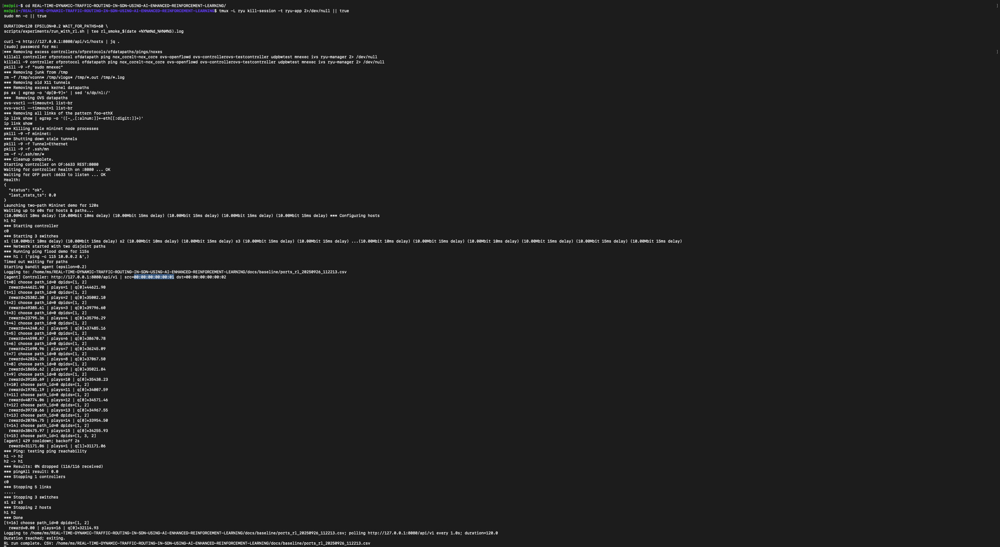

# 🚦 Real-Time Dynamic Traffic Routing in SDN using AI-Enhanced Reinforcement Learning

<p align="center">
  
</p>


Ryu-based OpenFlow13 controller with:
- Topology discovery + k-shortest paths
- REST API for stats, paths, and actions
- Flow install/delete with cookies + timeouts
- Multi-armed Bandit + LinUCB agents to select paths using live stats
- Derived link utilization (`/metrics/links`)
- OpenAPI spec (`/openapi.yaml`)

---

## 👨‍💻 Contributors & Scope-of-Work 

### **Mayuresh Sanjay More – RL Agent, Experimentation & Project Integration**
- ✅ Designed and implemented **core reinforcement learning modules**
    - `rl-agent/bandit_agent.py` (ε-greedy with cooldown handling)
    - `rl-agent/linucb_agent.py` (contextual bandit with path-level features)
- ✅ Defined and refined the **reward function** using throughput, drops, and error penalties
- ✅ Orchestrated **end-to-end experiment automation** (`scripts/experiments/run_with_rl.sh`)
- ✅ Ran and validated **15-min and 1-hour test runs**, ensuring reproducible results with CSV logs
- ✅ Integrated RL agent decisions into controller actions for **dynamic path selection**
- ✅ Designed **dashboard-ready outputs** for comparative visualization (Baseline vs RL)
- 🔄 Next: Extend from contextual bandits to **deep RL (DQN/GNN)** for multi-topology support

---

### **Zeel Pankaj Patel – SDN Topology, Automation & Infrastructure**
- ✅ Built and validated **Mininet topologies** (`scripts/topos/two_path.py`) with multiple disjoint paths
- ✅ Authored **controller bring-up & orchestration scripts** (`scripts/run_ryu.sh`, `scripts/_ensure_controller.sh`)
- ✅ Developed **baseline and RL experiment wrappers** with integrated health monitoring
- ✅ Automated **Raspberry Pi & Ubuntu lab setup** with `docs/lab-setup.md` (networking, OVS, Mininet, Ryu)
- ✅ Coordinated **lab execution pipeline**, ensuring reliable runs across environments
- ✅ Contributed to **data logging & result organization** under `docs/baseline/` for performance comparison
- 🔄 Next: Extend topologies (fat-tree, mesh) and explore **scalability testing**

---

### **Omkar Gajendra Sutar – Controller REST API & Telemetry**
- ✅ Implemented **base controller apps**
    - `controller-apps/sdn_router_rest.py` (topology discovery, k-shortest paths, routing actions)
    - `controller-apps/monitor_rest.py` (health/stats endpoints)
- ✅ Contributed to **REST API design & OpenAPI spec** (`docs/openapi.yaml`, `docs/api.md`)
- ✅ Assisted in building **metrics logger** (`scripts/metrics/log_stats.py`) for per-second telemetry
- ⚡ Focused primarily on **API endpoints and telemetry plumbing**, enabling integration with RL agents
- 🔄 Next: Support advanced telemetry (QoS, latency metrics) and northbound policy hooks

---

## ⚡ Quick Start (Controller)
```bash
# Ensure Ryu is installed for Python 3.9+ (see requirements.vm.txt notes)
# Example with pyenv:
#   pyenv install 3.9.19
#   pyenv virtualenv 3.9.19 ryu39
#   pyenv activate ryu39
#   pip install -r requirements.vm.txt

./scripts/run_ryu.sh --ofp-port 6633 --wsapi-port 8080
curl http://127.0.0.1:8080/api/v1/health
```

---

## ⚙️ Running Experiments

### Baseline (shortest path)
```bash
DURATION=900 scripts/experiments/run_baseline.sh | tee baseline_$(date +%Y%m%d_%H%M%S).log
```

### With Reinforcement Learning
```bash
DURATION=900 EPSILON=0.2 WAIT_FOR_PATHS=120 scripts/experiments/run_with_rl.sh | tee rl_$(date +%Y%m%d_%H%M%S).log
```

Logs and CSV results are stored under:
```
docs/baseline/
```


---

### Key Observations
- **Baseline:** Higher packet drop, lower throughput.  
- **RL Agent:** Learns optimal multi-path routing, reduces packet drops, improves aggregate throughput.

---

## 🛠️ Tech Stack
- **SDN Controller:** Ryu  
- **Network Emulator:** Mininet  
- **Switching:** Open vSwitch  
- **RL Agent:** Python (Multi-armed Bandit)  
- **Visualization:** Matplotlib, Pandas  

---

## 📅 Project Status
- ✅ Baseline and RL experiments tested (15-min and 1-hour runs)  
- ✅ Logs and CSV outputs recorded for dashboards  
- 🔄 Next: Optimize reward function for stability  

---

## ⭐ Acknowledgements
Special thanks to  professor Solomon Berhe and peers at **University of the Pacific** for guidance.
