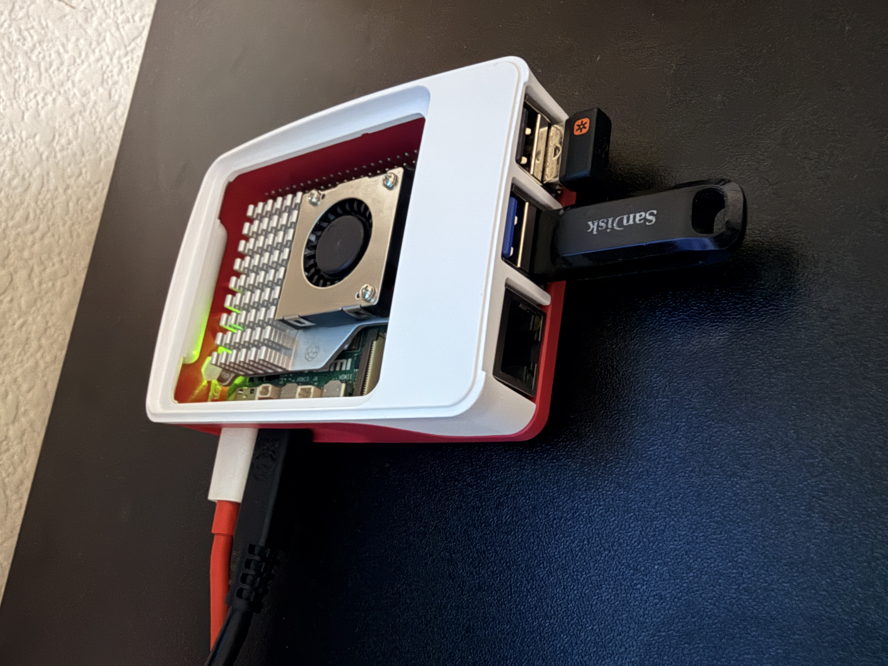

# 🚦 Real-Time Dynamic Traffic Routing in SDN using AI-Enhanced Reinforcement Learning

<p align="center">
  
</p>

---

## 🧠 Overview

This project implements a **real-time adaptive SDN controller** using **Reinforcement Learning (RL)** to dynamically select optimal network paths.  
It is built on **Ryu (OpenFlow 1.3)**, with **Mininet** as the network emulator, and integrates three RL agents:

- 🎯 **Bandit Agent (ε-Greedy)** — baseline exploration/exploitation  
- 🧠 **LinUCB Agent** — contextual bandit with path-level features  
- 🧬 **DQN Agent** — deep neural network for state-based decision-making  

---

## ⚙️ System Architecture

**Closed-Loop Design:**

```
Mininet Topology (Two-Path / Fat-Tree)
        ↓
Ryu SDN Controller
  ↳ REST Telemetry (ports, flows)
  ↳ Path APIs (/paths, /actions/route)
        ↓
RL Agent (Bandit / LinUCB / DQN)
        ↓
Adaptive Path Reconfiguration
```

---

## 📂 Repository Structure

```
REAL-TIME-DYNAMIC-TRAFFIC-ROUTING-IN-SDN-USING-AI-ENHANCED-REINFORCEMENT-LEARNING/
├── controller-apps/
│   └── sdn_router_rest.py        # Unified controller + REST + stats
├── rl-agent/
│   ├── bandit_agent.py           # ε-greedy multi-armed bandit
│   ├── linucb_agent.py           # contextual bandit (ridge regularized)
│   └── dqn_agent.py              # deep Q-network agent (PyTorch)
├── scripts/
│   ├── topos/two_path.py         # dynamic topology generator
│   ├── metrics/log_stats.py      # metrics logger
│   ├── metrics/plot_results.py   # plotting utility
│   ├── experiments/              # automated run scripts
│   └── run_ryu.sh                # controller launcher
├── docs/
│   ├── baseline/                 # CSV logs + plots
│   ├── api.md                    # REST documentation
│   └── openapi.yaml              # OpenAPI schema
├── Makefile                      # automation entrypoint
├── requirements.vm.txt           # minimal dependencies
└── README.md                     # this file
```

---

## 🧰 Quick Start

### 1️⃣ Install Dependencies
```bash
make setup
```

### 2️⃣ Start the SDN Controller
```bash
make run-controller
```
Then check the health endpoint:
```bash
curl http://127.0.0.1:8080/api/v1/health
```

---

## 🧪 Running Experiments

### Baseline (Shortest Path)
```bash
make run-baseline
```

### Bandit RL Agent (ε-Greedy)
```bash
make run-bandit
```

### LinUCB Contextual Bandit
```bash
make run-linucb
```

### Deep Q-Network Agent (PyTorch)
```bash
make run-dqn
```

### Generate Comparative Plots
```bash
make plot
```

Or for all experiments:
```bash
make compare
```

---

## 📈 Example Output

After each experiment, CSV logs are stored under:
```
docs/baseline/
 ├── ports_baseline_<timestamp>.csv
 ├── ports_rl_<timestamp>.csv
 ├── ports_dqn_<timestamp>.csv
 └── plots/
     ├── throughput.png
     ├── drops.png
     └── errors.png
```

Sample Plot (generated automatically):

<p align="center">
  
</p>

---

## 🧮 Reward Function (Generalized)

For all agents, the reward is computed as:

```
R = (Throughput / MaxBW) – α*(ErrorRate + DropRate)
```

where `α` is dynamically tuned (0.001–0.01).  
This balances high throughput with low packet loss.

---

## 🧩 RL Agent Comparison

| Agent | Algorithm | Context | Exploration | Advantage |
|--------|------------|----------|-------------|------------|
| **Bandit** | ε-Greedy | None | Fixed ε | Simple baseline |
| **LinUCB** | Contextual Bandit | Per-path metrics | UCB confidence | Stable performance |
| **DQN** | Deep Q-Network | Multi-feature vector | ε-decay | Learns nonlinear state-action mapping |

---

## 🌐 Topology Example

Run the two-path topology with custom parameters:

```bash
sudo python3 scripts/topos/two_path.py   --delay_a 5ms --loss_a 0.1   --delay_b1 15ms --delay_b2 15ms   --loss_b1 0.5 --loss_b2 0.5   --bw 20 --no_cli
```

---

## 📅 Experiment Workflow

1. Start Controller → `make run-controller`  
2. Launch Topology → `make topo`  
3. Run RL Agent → `make run-dqn` or `make run-linucb`  
4. Collect CSV Logs → `docs/baseline/*.csv`  
5. Plot & Compare → `make compare`

---

## 🧪 Publication Readiness

This repository provides:
- **Reproducible experimental setup** with automated scripts  
- **Quantitative performance comparison** (baseline vs RL vs DQN)  
- **Deep RL component (DQN)** for novelty  
- **OpenAPI-documented REST interface** for integration  

Potential publication targets:
- IEEE ICNP / CNSM Demo Track  
- Elsevier *Computer Networks*  
- ACM NetAI or CoNEXT Student Workshop  

---

## 👨‍💻 Contributors

| Name | Role | Key Contributions |
|------|------|-------------------|
| **Mayuresh Sanjay More** | RL Agent & Experimentation Lead | Bandit, LinUCB, DQN, reward tuning |
| **Zeel Pankaj Patel** | Infrastructure & Automation | Mininet topologies, scripts, Ryu integration |
| **Omkar Gajendra Sutar** | Controller & REST API | Ryu app design, telemetry endpoints |

---

## ⚡ Future Enhancements

- [ ] Extend DQN to Double-DQN or Dueling DQN  
- [ ] Multi-agent cooperation for multiple flows  
- [ ] Topology generalization (Fat-Tree, Mesh)  
- [ ] Real-world Raspberry Pi deployment (edge-lab)  
- [ ] Publish results + graphs in academic demo paper  

---

